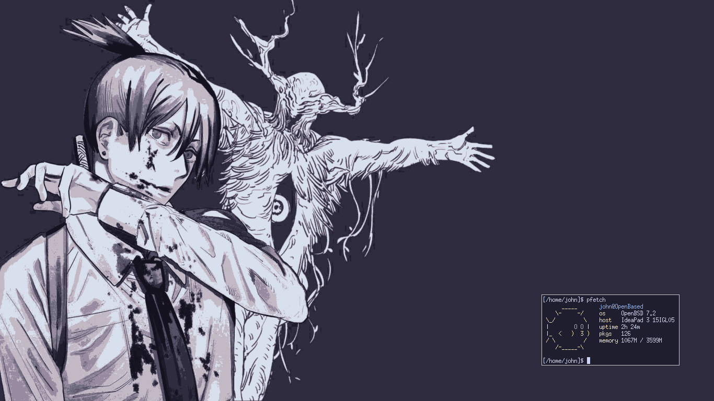

# Setup OpenBSD 
Nesse repositório está o meu setup do [OpenBSD](https://openbsd.org).  
Nele, é utilizada a paleta de cores [Catppuccin](https://github.com/catppuccin/catppuccin).  

### Programas  
Alguns programas que eu uso são:
- `zathura + zathura-pdf-poppler`		-	Visualizador de pdf's  
- `yt-dlp`		-	Youtube downloader  
- `feh`			-	Visualizador de imagens e configurador de wallpapers  
- `dunst`		-	Daemon de notificações  
- `vim`			-	Editor de texto/IDE  

### A fazer  
- [ ] Script de configuração automática  
- [ ] ~~Adicionar a função de scrollback ao ST~~ (agora eu uso o xterm)

### Preview  

